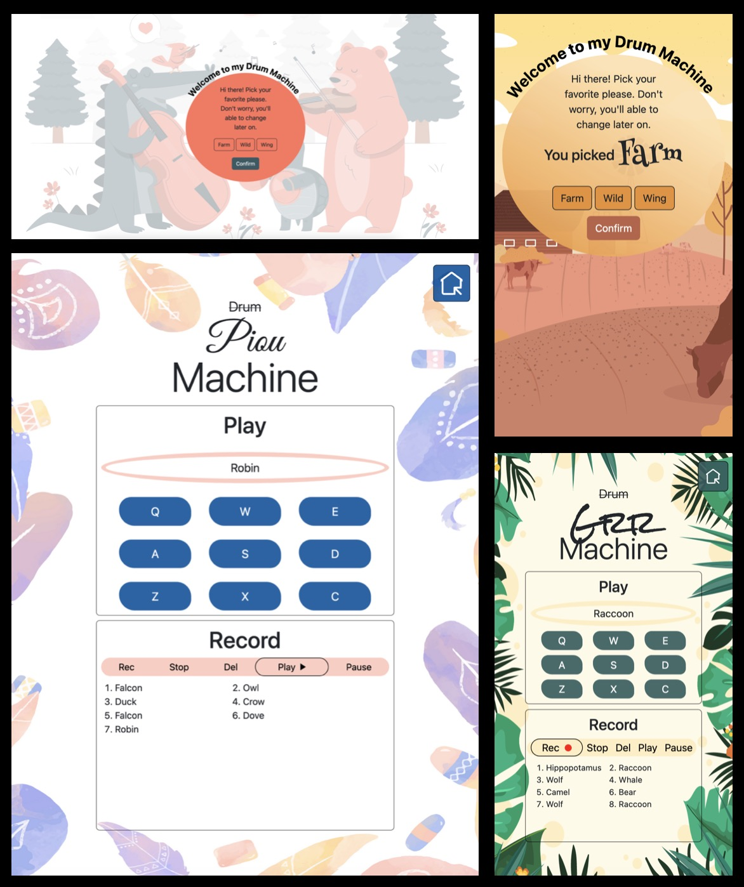

# Front End Development Libraries Project 3 - FreeCodeCamp

This is a ~~drum~~ machine. It’s part of the required projects to complete FreeCodeCamp’s Front End Development Libraries certification.

## Table of contents

- [Overview](#overview)
  - [The challenge](#the-challenge)
  - [Screenshot](#screenshot)
  - [Links](#links)
- [My process](#my-process)
  - [Built with](#built-with)
  - [What I learned](#what-i-learned)
  - [Continued development](#continued-development)
  - [Useful resources](#useful-resources)
- [Author](#author)

## Overview

### The challenge

The goal is to build an app that is functionally similar to the [drum machine](https://drum-machine.freecodecamp.rocks/) given as an example.

The exact requirements:

1. There is an outer container with a corresponding `id="drum-machine"` that contains all other elements.
2. Within `#drum-machine`, there is an element with a corresponding `id="display"`.
3. Within `#drum-machine`, there are 9 clickable drum pad elements, each with a class name of `drum-pad`, a unique id that describes the audio clip the drum pad will be set up to trigger, and an inner text that corresponds to one of the following keys on the keyboard: `Q`, `W`, `E`, `A`, `S`, `D`, `Z`, `X`, `C`. The drum pads MUST be in this order.
4. Within each `.drum-pad`, there should be an HTML5 `audio` element which has a `src` attribute pointing to an audio clip, a class name of `clip`, and an id corresponding to the inner text of its parent `.drum-pad` (e.g. `id="Q"`, `id="W"`, `id="E"` etc.).
5. Clicking on a `.drum-pad` element triggers the audio clip contained in its child `audio` element.
6. When the trigger key associated with each `.drum-pad` is pressed, the audio clip contained in its child `audio` element should be triggered (e.g. pressing the `Q` key should trigger the drum pad which contains the string `Q`, pressing the `W` key should trigger the drum pad which contains the string `W`, etc.).
7. When a `.drum-pad` is triggered, a string describing the associated audio clip is displayed as the inner text of the `#display` element (each string must be unique).

### Screenshot




### Links

- Challenge URL: [Challenge URL](https://www.freecodecamp.org/learn/front-end-development-libraries/front-end-development-libraries-projects/build-a-drum-machine)
- Live Site URL: [Live site URL]()

## My process

### Built with

- Bootstrap 5
- BEM methodology
- Sass
- jQuery

### What I learned

Phew! This one was a big one! Actually, the requirements weren't that high, but I definitely went above and beyond, that's why it took me a little while and gave me a hard time! Don't get me wrong, I definitely loved working on that third FCC's project! I was just not expecting it to be that time-consuming. 

I decided to create three different themes instead of a single one. My goal was to let the user pick their favorite one and also switch between them, that's why I created a totally independent 'welcome' page dedicated to that purpose. I had never built an app with different themes before. It was an amazing way for me to realize how much work (and fun!!!) it implies, and also to understand the necessity of writing reusable code. 

It was the first time I was working with audio files, it was really appreciable and interesting to understand how to handle them. The biggest challenge for me was to implement the control panel with the recording, stop, play, pause and delete functionalities. I tried many different ways to make it work before actually finding one!

Finally, I had the opportunity to use async code in a project and I find that very useful: 
```
function addDelay(ms) {
    return new Promise(resolve => setTimeout(resolve, ms));
}

async function playOrResume() {

    let i = 0;

    while (i < soundsList.length) {

        $(`button[class|='drum']:eq(${soundsList[i]})`).children()[0].play();

        let currentSoundDuration = Math.ceil($(`button[class|='drum']:eq(${soundsList[i]})`).children()[0].duration * 1000) + 500;

        await addDelay(currentSoundDuration);
        
        if ($(`button[class|='drum']:eq(${soundsList[i]}) audio`).hasClass('ended')) {

            i++;

            if (i === soundsList.length) {
                soundsList = soundsRecorded;

                handleRemoveActive('#play');

                $('#stop').addClass('machine__controls--hover');
                $('#stop').children().removeClass('d-none').addClass('hold');

                break;
            }

        } else {

            soundsList = soundsList.slice(i);
            break;
            
        }

    }

}
```

Let's summarize what I've learned:

 - Use audio files in my project
 - Manipulate (play, pause, record, etc.) audio elements with JavaScript
 - Create multiple themes for the same app
 - Build a welcome page AND the actual app page
 - Use async / await and promises to delay sounds
 - Trigger specific events with specific key press
 - Reload a page with JavaScript
 - Use the `(orientation: landscape)` media query

### Continued development

In one hand, I'm really happy and proud of this project because it's probably one of the biggest, most complex one I've ever created, and I find the final result pretty good. I also fulfilled all FCC's requirements, that was the main goal, so that's nice. In the other hand, I feel like I could have done many things differently, probably better. 

I definitely messed up with the responsiveness. I didn't take it into consideration soon enough, and working on it later on made the task way harder than it should have been. It was definitely complicated to make it fully responsive, and I still find that even if it does the job now, it could have been better. 

I also think that my JavaScript skills still need to be improved. I feel like I haven't totally respected the DRY principle because I was unsure about how to avoid repeating myself. 

Finally, a few months ago, at the very beginning of my coding journey, I had strictly no idea that organizational skills were crucial as a developer! I found myself, so many times, lost in my own files/ code snippets, even if I'm an organized type of person in my daily life! I absolutely want to work on that asap.  

### Useful resources

- [DOM Audio Object](https://www.w3schools.com/jsref/dom_obj_audio.asp) - I always appreciate W3Schools explanations because they are straightforward and most of the time up to date. It helped me to understand the methods and properties available on the Audio Object.  
- [Asynchronous code](https://www.youtube.com/watch?v=TnhCX0KkPqs) - Not that long ago, I was really lost with async code but thanks to [ColorCode](https://www.youtube.com/@ColorCodeio), I finally understood promises and async / await! Really cool videos, highly recommended!
- [Bootstrap 5](https://getbootstrap.com/docs/5.3) - I love Bootstrap's documentation! I find it very well done. It makes it easy to navigate between the different topics and to find whatever info you need. 

## Author

- GitHub - [@Leo-Code-CA](https://github.com/Leo-Code-CA)
- FreeCodeCamp - [@Leo-code](https://www.freecodecamp.org/Leo-code)
